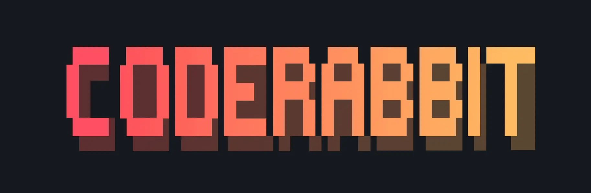

Thank you [CodeRabbit](https://www.coderabbit.ai/?ref=app-ideas) for sponsoring this repository! 🙏

# :ledger: App Ideas Collection

Have you ever wanted to build something but you had no idea what to do? Just as
authors sometimes have "writers block" it's also true for developers. This list is intended to solve this issue once and for all! 👍

These applications are:

-   great for improving your coding skills :muscle:;
-   great for experimenting with new technologies 🆕;
-   great for adding to your portfolio to impress your next employer/client :file_folder:;
-   great for using as examples in tutorials (articles or videos) :page_with_curl:;
-   easy to complete and also easily extendable with new features :ok_hand:;
-   **perfect for Hacktoberfest contributions** 🎃;

This is not just a simple list of projects, but a collection that describes each project in enough detail so that you can develop it from the ground up!

Each project has the following **features**:

1. A clear and descriptive objective;
2. A list of _User Stories_ which should be implemented (these stories act more as a guideline than a forced list of _To-Do's_. Feel free to add your own stories if you want);
3. A list of bonus features that not only improve the base project, but also your skills at the same time (these are optional and should be attempted only after you have completed the required user stories)
4. All the resources and links to help you find what you need to complete the project

Here you can [watch a video about this repository](https://www.youtube.com/watch?v=TNzCfgwIDCY).

## Projects

Projects are divided into three tiers based on the knowledge and experience
required to complete them.
